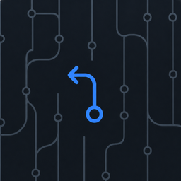
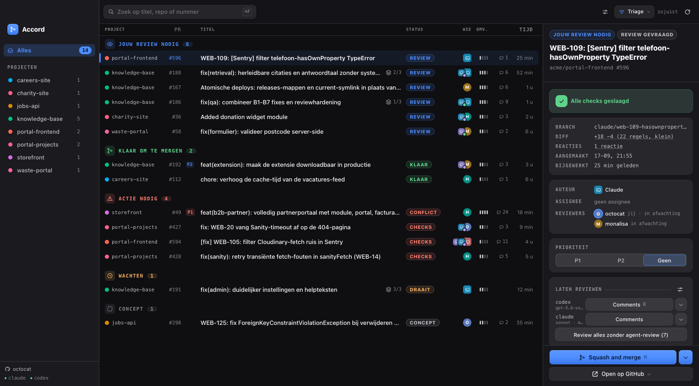
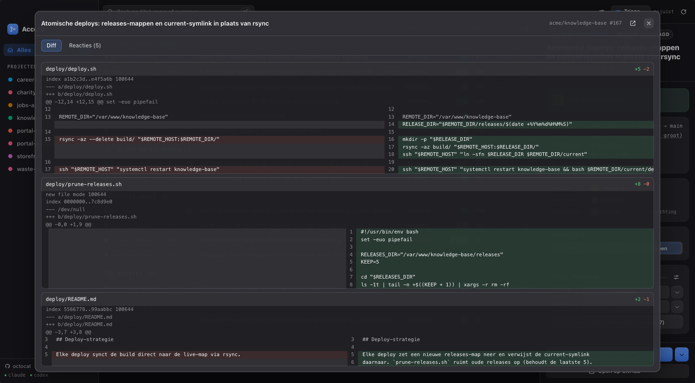

<div align="center">



# Accord

**Every pull request that is waiting on you, in one native window.**

Grouped by what each one needs from you. Stacks made visible. Review, prioritise
and merge without opening a browser tab.

[](LICENSE)




</div>

---

GitHub's notification inbox tells you that *something* changed. Accord tells you
what is yours: which reviews are pending on you, which of your own PRs are stuck,
what is blocked by a red pipeline, and what you could merge right now. It lives in
your menu bar and keeps the count in front of you.

## What it does

- **Grouped by what it needs from you.** The list opens in sections: your review,
  ready to merge, needs action, agent running, waiting, draft. The sidebar lists
  your repositories with their counts and filters the list to one of them, and
  grouping by project is one of the sort modes if you prefer that view.
- **Stacks made visible.** If PR B branches off PR A, Accord shows the chain and
  tells you to merge #A first, instead of letting you merge into a branch that is
  about to disappear.
- **Priority your team can see.** P1 and P2 are written back as GitHub labels, so
  the priority you set is not private to your machine.
- **Reviews by Claude or Codex.** Kick off an AI review per PR, choosing between
  comments only or comments plus pushed fixes. The agent runs in a throwaway git
  worktree of your local clone, so your own working tree is never touched. The
  other agent is preselected by default: if Claude wrote the PR, Codex reviews it.
  Next to a review, the same menu offers the fix actions that apply to this PR:
  resolve the open comments, fix the failing checks, fix a merge conflict, or
  distil the lessons from the review into the repository's own instructions.
- **Diff and conversation in the app.** A split-view diff and the review threads
  in an inspector overlay, so triage does not need a browser.
- **Merge from the app**, and when you cannot, the exact reason why: red CI,
  conflicts, draft, changes requested, or a stack base that has to go first.
- **Stacks rebase themselves.** Merge a PR and the PRs stacked on top of it are
  rebased onto their new base, so the chain does not rot while you work through
  it. One switch in the settings turns it off.
- **Sort, search, favourites.** Six sort modes (triage, priority, updated,
  oldest, size, project), a search box that matches title, repository name and
  number, and repositories you star pinned to the top of the sidebar. Every
  choice is remembered per machine.
- **System notifications** when an agent run finishes or fails, when CI on one of
  your own PRs turns red, and when a merge completes. Only while the window is
  not focused: with the app in front of you, the list already says it. The first
  one asks the OS for permission; refuse it and Accord stays quiet for the rest of
  the session while the setting itself stays on.
- **A window you can shape.** Sidebar and detail panel drag to any width, and so
  do the list columns. Narrow the window and the list folds columns back in a
  fixed order instead of letting rows run over the edge.
- **Menu bar counter** with the number of PRs awaiting your review. Closing the
  window keeps the app running in the menu bar.
- **Keyboard first**, with an in-app shortcut sheet, a light, dark or system
  theme applied before the first paint, and it updates itself from the latest
  GitHub release.



The interface is in Dutch; there is no localisation layer yet.

## Install

Grab a bundle from the
[latest release](https://github.com/dennispassway/accord/releases/latest). The
GitHub OAuth client ID is baked into those builds, so there is nothing to
configure: download, open, sign in.

### macOS (Apple Silicon)

The `.dmg` is built for `aarch64`; there is no Intel build. Open it and drag
**Accord** to Applications. macOS then refuses to launch it with *"Accord cannot
be opened because the developer cannot be verified"*, because the app is only
ad-hoc signed and not notarised with an Apple Developer certificate. Clear the
quarantine flag that the download put on it:

```bash
xattr -dr com.apple.quarantine /Applications/Accord.app
```

After that it launches normally. Skipping this step and getting the app to run
some other way is not enough: macOS then relocates it to a randomised read-only
path (App Translocation), which breaks the built-in updater.

### Linux (x86_64)

Take the `.deb`, `.rpm` or `.AppImage`. You need a running keyring
(gnome-keyring or kwallet): the GitHub token is stored through the Secret
Service, and without one, signing in cannot persist.

### Signing in

On first launch you sign in with a device code shown by the app, which you enter
on github.com. The token goes into the macOS Keychain (or the Secret Service on
Linux), never into a file. Accord asks for the `repo` and `read:org` scopes
deliberately: it writes labels and merges. If your pull requests live in an
organisation that restricts third-party OAuth apps, someone with owner rights has
to approve **Accord** there before the token gets access.

### Building it yourself

Contributors and anyone who would rather use their own OAuth app can build from
source:

```bash
git clone https://github.com/dennispassway/accord.git
cd accord
pnpm install
pnpm tauri dev
```

Create the OAuth app once: GitHub → Settings → Developer settings → OAuth Apps →
New OAuth App. The homepage and callback URL can be anything (device flow does not
use them), tick **Enable Device Flow**, and no client secret is needed. Put the
client ID in a dotenv file in the repository root:

```
VITE_GITHUB_CLIENT_ID=Ov23li...
```

### Requirements

- **macOS** with Xcode Command Line Tools (`xcode-select --install`), or **Linux**
  with the system dependencies listed in `.github/workflows/release.yml`
  (`libwebkit2gtk-4.1-dev` and friends). Tauri links against the system webview.
- **Node** and **pnpm**. CI builds on Node 22 and pnpm 10; there is no `engines`
  field or `.nvmrc`, so nothing enforces this locally. The repo ships a
  `pnpm-lock.yaml`; use pnpm, not npm or yarn.
- **Rust**, with `cargo` on your `PATH`.

<details>
<summary>Cargo installed through Homebrew? Fix your PATH first</summary>

If Rust came from `brew install rustup`, `~/.cargo/bin` stays empty and `cargo`
only exists inside the brew prefix. `pnpm tauri dev` then fails with:

```
failed to run 'cargo metadata' command to get workspace directory:
failed to run command cargo metadata --no-deps --format-version 1:
No such file or directory (os error 2)
```

That does not mean Rust is missing, only that the shims are not on your `PATH`:

```bash
echo 'export PATH="/opt/homebrew/opt/rustup/bin:$PATH"' >> ~/.zshrc
```

An install from rustup.rs needs none of this.

</details>

### Optional: agents and local clones

The review actions need the `claude` and/or `codex` CLI, plus the `gh` CLI to post
comments. If a CLI is missing, that button is disabled with an explanation; the
overview and merging always work.

Accord also needs to know where each repository lives locally. The detail panel has
a button that scans `~/Projects` and `~/Code` and matches clones on their origin
remote; you can also type a path by hand.

## Development

Two loops, pick the one that matches what you are doing.

**The real app** - `pnpm tauri dev`. Compiles the Rust side and opens the window
with the menu bar icon. Required for anything touching Tauri: login, Keychain,
agent runs and the tray.

**UI only** - `pnpm dev`, then `http://localhost:1420/?mock=app` in a normal
browser. Renders the full app from fixtures: no Rust compile, no GitHub, no login.
By far the fastest loop for CSS and component work.

Mock mode is dev-only (`src/lib/mock/mode.ts`) and has these variants:

| URL | Shows |
| --- | --- |
| `?mock=app` (or bare `?mock`) | The app with fixture PRs |
| `?mock=app&truncated` | Same, with the search-limit truncation banner |
| `?mock=app&detailfout` | Same, with the inspector forced into its error state |
| `?mock=login-client` | Login screen without a client ID configured |
| `?mock=login-uit` | Signed-out state |
| `?mock=login-device` | Device flow screen with a code |
| `?mock=update` | The app with the update card in the corner |

One thing worth knowing: **port 1420 is fixed** (`strictPort` in `vite.config.ts`;
Tauri requires a fixed port). If a dev server is already running, the second one
fails with "Port 1420 is already in use"; reuse the running one.

### Scripts

| Script | Does |
| --- | --- |
| `pnpm tauri dev` | Run the app in dev mode (frontend plus Rust) |
| `pnpm tauri build` | Build the app bundle and installer |
| `pnpm dev` | Frontend only on port 1420, for mock mode |
| `pnpm build` | Typecheck plus production build of the frontend into `dist/` |
| `pnpm preview` | Serve the built `dist/` locally, without Tauri |
| `pnpm lint` / `pnpm lint:fix` | Biome check |
| `pnpm format` | Biome formatter |
| `pnpm typecheck` | TypeScript strict, no emit |
| `pnpm test` / `pnpm test:coverage` | Vitest |
| `pnpm knip` | Dead code and unused dependencies |

The Rust side is tested with cargo:

```bash
cargo test --manifest-path src-tauri/Cargo.toml
```

### Layout

- `src/lib/github/` - the data layer: domain model, GraphQL queries and parsing,
  stack detection, labels, merge and the auto-rebase of stacked branches. No React
  anywhere in here, and almost all of it is pure and tested. Two files are the
  exception and call into Rust through `invoke`: `tauriFetch.ts` and
  `autoRebase.ts`.
- `src/lib/` (top level) - settings and theme storage, the notification rules, the
  PR snapshot that fills the list on a cold start, retry and platform helpers.
- `src/lib/mock/` - fixtures and mode detection for the mock mode above.
- `src/features/auth/` - device flow login and session state.
- `src/features/prs/` - the main UI (sidebar, list, detail panel, inspector).
- `src/features/agents/` - starting, following and cancelling agent runs.
- `src/features/update/` - update check and the update card.
- `src/features/settings/` - the settings sheet and the logout confirmation.
- `src-tauri/src/` - `auth.rs` (device flow plus Keychain), `github.rs` (every HTTP
  request to GitHub), `repos.rs` (project paths), `agents.rs` (worktree plus agent
  process), `claude_stream.rs` (parsing the Claude CLI output stream), `stacks.rs`
  (rebasing stacked branches), `tray.rs` (menu bar).
- `docs/` - design documents, handoffs from earlier sessions and the screenshots
  above (in Dutch).
- `.claude/rules/` - per-path notes on the things that break silently here: GitHub
  over Rust, the column layout, pointer drags, stored preferences. Each file opens
  with the paths it applies to.

GitHub traffic deliberately skips the webview's `fetch`: the frontend calls
`src/lib/github/tauriFetch.ts`, which hands the request to `github.rs` and gets a
typed error kind back. The reasons are in `.claude/rules/github-http-via-rust.md`.

## Building and releasing

```bash
pnpm tauri build
```

Produces an app bundle plus installer under `src-tauri/target/release/bundle/`
(`macos/Accord.app` and `dmg/`). The first build compiles the entire Rust
dependency tree and takes a while; cargo caches after that.

Releases run through release-please and need no manual version bumps:

1. Commit to `main` using conventional commits (`feat:`, `fix:`, ...).
2. release-please maintains a release PR with the next version and the changelog.
3. Merging that PR bumps the version, creates the `vX.Y.Z` tag and a GitHub
   Release, and kicks off the build that attaches the installers and the updater
   artifacts.

The version lives in one place: `package.json`. `src-tauri/tauri.conf.json` points
at it (`"version": "../package.json"`) and release-please bumps
`src-tauri/Cargo.toml` along with it (`extra-files` in `release-please-config.json`).

`src-tauri/Cargo.lock` is not in that `extra-files` list, so it keeps the previous
version after a release. The next cargo command in `src-tauri/` rewrites the one
line; commit that as a follow-up chore. Nothing fails on the mismatch, which is
why it has slipped through three times already.

Tauri cannot cross-compile, so `.github/workflows/release.yml` builds on both
macOS and Ubuntu runners. A manual `workflow_dispatch` run builds without
releasing and attaches the bundles plus the updater artifacts (`.sig`) as run
artifacts, so a build can be verified before it is published.

The client ID is not a secret in the device flow, so it comes from the
`VITE_GITHUB_CLIENT_ID` repository variable rather than a secret. It has to be
present in the environment of the `tauri-action` step, because that step runs
`beforeBuildCommand` (`vite build`), which inlines it.

## Updates

Accord checks for a new version at startup and then on the PR refresh interval
(`plugins.updater` in `src-tauri/tauri.conf.json`, pointing at `latest.json` on the
newest GitHub Release). If there is one, a card appears in the corner with the
release notes; "Update and restart" downloads, installs and relaunches. A failed
check (offline, or no release yet) stays silent.

Bundles are signed with a minisign key: the public half sits in `tauri.conf.json`,
the private half and its password are GitHub secrets
(`TAURI_SIGNING_PRIVATE_KEY`, `TAURI_SIGNING_PRIVATE_KEY_PASSWORD`). Lose that key
and existing installs can never update again.

**macOS caveat:** the app is ad-hoc signed (`signingIdentity: "-"`), and such a
signature has no stable designated requirement. macOS therefore does not recognise
the updated app as the same app and may refuse it as "damaged". Clearing the
quarantine flag again (`xattr -dr com.apple.quarantine /Applications/Accord.app`)
is the route that reliably works; right-click → Open no longer does on current
macOS. A dependable update flow on macOS needs an Apple Developer ID certificate
($99/year) plus notarisation. Linux is unaffected.

## Platform differences

Linux works, with the expected divergences: shortcuts use Ctrl instead of ⌘, the
window has a regular title bar, and the token goes into the Secret Service (GNOME Keyring/KWallet) instead of the Keychain.
Windows is not supported yet: the process handling for agent runs is unix-only.

## License

[MIT](LICENSE) © Dennis Passway
